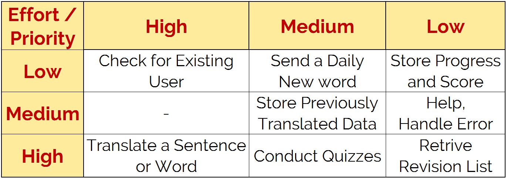
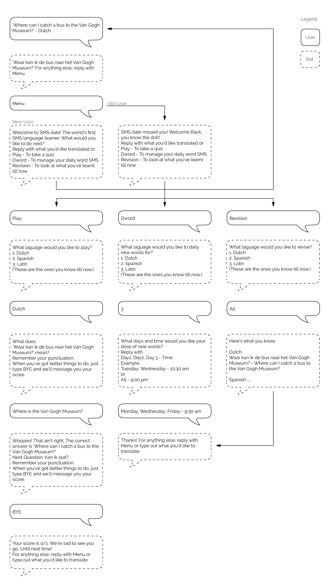

# Final Project: **SMS-ilate** 

## Summary
'SMS-ilate’ is a language learning sms platform which will translate a user’s message, in the language the user specifies, and message it back to them.

## Details 
Using the Google Translate API, the app will translate the contents of an sms into the language the user specifies. This is a one-step alternative to typing out your query, on google translate, in a browser. It avoids the added clutter of yet another app on your phone and still retain the history of your previous translations in your messages. It will have a backend database which will store all previous sentences searched, known words and the frequency of the words, for the various languages translated. 

<b>Secondary functions</b> could include a quizzing game based of the user’s database, a daily message with a new word and a revision list of sentences or words searched in each language. 

<b>Tertiary Function</b> could include a connection to a social API such as Facebook or Twitter. A user can share scores from the quiz or share progress in a language.

 
## Scenario 
Vishal just stepped out of the Funky Monkey in Amsterdam and the next stop on his trip  is the Van Gogh Museum. He needs to take a bus there but isn't sure where and how far the bus stop is. He decides to ask someone, but not knowing the language, he takes out his phone and looks through his messages from SMS-ilate to find words he can string together. The app has improved his Dutch and he now tries to build sentences together from words he already knows. 
He can't find what he's looking for so he sends a messages. 

<i>'Where can I catch a bus to the Van Gogh Museum?' - Dutch </i>, Hits Send.

The phone beeps.

<i>'Waar kan ik de bus naar het Van Gogh Museum?' For anything else, reply with Menu.</i>

He goes up to a passerby on the street, asks him and is pointed in the right direction.

## Functionality Matrix

## Workflow Diagram 

